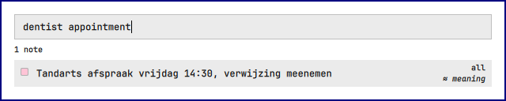
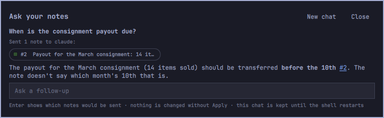
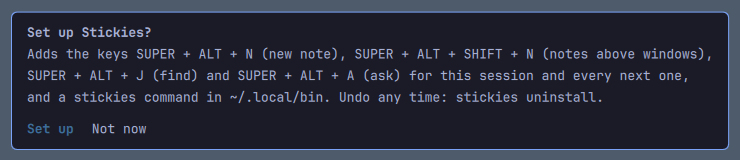
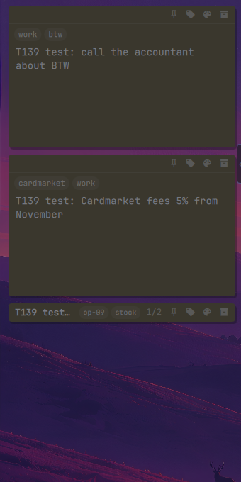
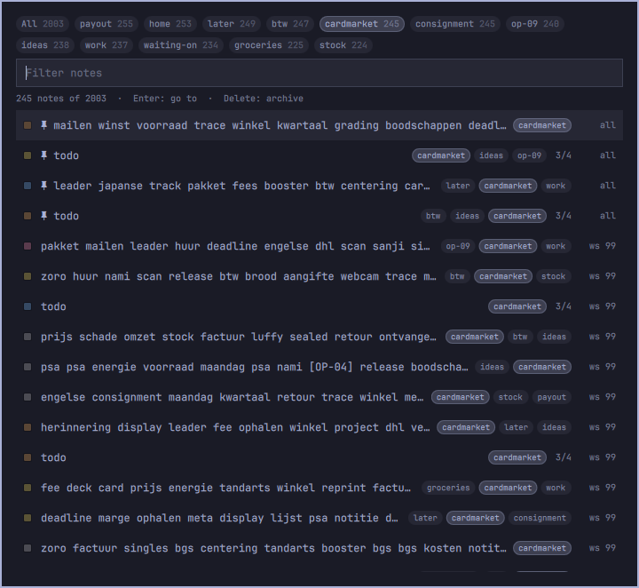
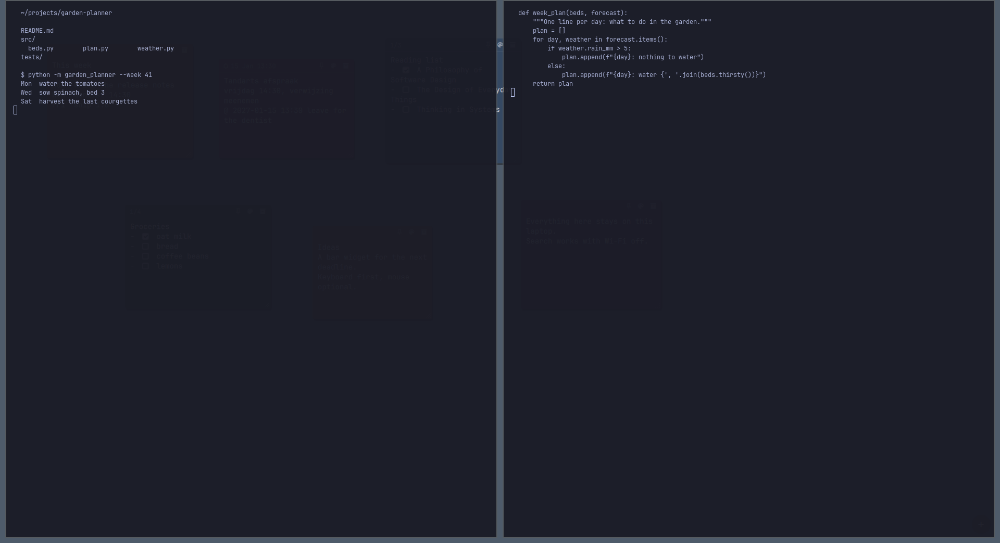
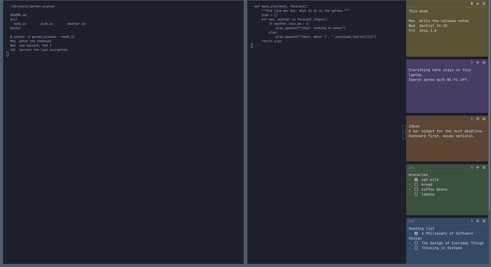
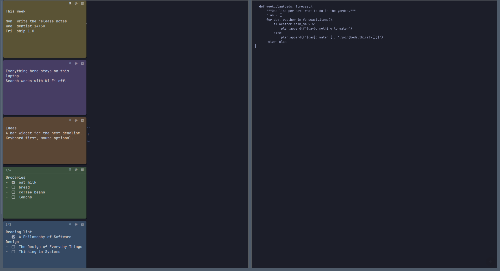

# Stickies for Omarchy

Sticky notes that live on your Omarchy desktop, find any note by its words
or its meaning offline, and let you ask questions about them.

## Why

- **On your desktop, not in an app.** Notes sit on the wallpaper under
  your windows, or in a column at the edge of the screen beside them. One
  key brings them in front of everything, another makes a new one.
- **Finds notes by meaning, across languages, offline.** Write each note
  in whatever language comes naturally and search in another:
  "dentist appointment" finds *Tandarts afspraak vrijdag*. For now that
  means Dutch and English, the two languages it is tested on (every
  cross-language test query found its note in the top 5). The model
  covers about 100 languages, but the others are not measured yet. Words
  and meaning are searched together, on your CPU, with Wi-Fi off.
- **Ask your notes without sending all of them.** A question goes to
  Omarchy's default agent with only the few notes it needs. You see which
  ones, and you can untick any of them before anything is sent.

## Features

- Drag, resize, type and recolour notes in place. Changes save themselves.
- Notes belong to a workspace and a monitor. Pinned notes show on every
  workspace. Every monitor shows its own notes, rotated ones included.
- Front mode: `SUPER + ALT + SHIFT + N` lifts this workspace's notes above
  your windows. `Esc`, a click outside the notes or switching workspace
  puts them back.
- Three [layouts](#layouts): free, or a waterfall column on the left or
  right that floats beside your tiled windows.
- [Tags](#tags-and-all-notes): put notes in buckets (`work`, `cardmarket`),
  shown as small chips under the header. Search finds them by tag.
- [All notes](#tags-and-all-notes) (`SUPER + ALT + O`): every note on every
  workspace in one list, filtered by tag and by text as you type.
- Checklists: `- [ ]` lines become checkboxes, and the header counts what is
  done.
- Reminders: a line like `@ tomorrow 9:00 call the plumber` brings that
  note's message up on the desktop at that time, with a notification
  that a note is due.
- Roll a note up to its first line, archive it with undo, tidy a workspace's
  notes into a grid, and snap notes to each other while dragging.
- Quick capture: `SUPER + ALT + V` turns the clipboard's text into a note.
- Colours follow your Omarchy theme and change with it.
- A bar widget with the note count, quick capture, search, and your pinned
  and recent notes.
- A search overlay: results as you type, by words and by meaning, Enter
  jumps to the note.
- A chat overlay: answers cite the notes they used, and can suggest a new
  note, an addition to a note or a todo. Nothing changes until you click
  Apply. Chat cannot delete anything.
- A note you leave empty is thrown away.
- The same notes from a CLI with `--json` on every command, for scripts and
  coding agents.

| Find (`SUPER + ALT + J`) | Ask (`SUPER + ALT + A`) |
|---|---|
|  |  |

## Install

Requirements: [Omarchy](https://omarchy.org) (Hyprland with omarchy-shell)
and Python 3 with SQLite FTS5 (tested with 3.14, Arch's `python`). Chat also needs
Omarchy's default agent (`claude`). Search by meaning is an optional,
one-time download; see [Search and privacy](#search-and-privacy).

    omarchy plugin add https://github.com/eastbluewizard-official/omarchy-stickies --enable

On its first start the desktop asks once whether to add the keys and a
`stickies` command in `~/.local/bin`:

Nothing is added unless you click *Set up*. The keys are added to the
running Hyprland (`hyprctl eval`), so no config file is written. Changed
your mind later? Run `stickies integrate --yes`, or
`~/.config/omarchy/plugins/eastbluewizard.stickies/stickies integrate --yes`
if you said no to the command too.

**Install with git.** Clone straight into the plugins folder and run its
`install.sh`:

    git clone https://github.com/eastbluewizard-official/omarchy-stickies \
        ~/.config/omarchy/plugins/eastbluewizard.stickies
    ~/.config/omarchy/plugins/eastbluewizard.stickies/install.sh

`install.sh` adds the same extras without asking: the `stickies` command
in `~/.local/bin`, and the keys as a file in
`~/.local/state/omarchy/toggles/hypr/`, which Omarchy loads. It enables
the plugin and edits none of your own config files. It refuses to run
from anywhere else.

## Updating

    omarchy plugin update eastbluewizard.stickies

This fetches the latest commit, shows you the changes, and updates after
you say yes. If you installed with git, run `git pull` in
`~/.config/omarchy/plugins/eastbluewizard.stickies` instead.

Then restart the shell once to load the new version:

    omarchy-restart-shell

omarchy-shell notices the update and reloads its plugins, but it keeps
the desktop code it loaded when it started. So until the restart, the
notes on your desktop run the previous version, and a key that the update
added answers "Function not found". Stickies sends a notification after
an update to remind you, and again if such a key is pressed.

Check which version is installed:

    stickies --version

## Keys

| Key | Does |
|---|---|
| `SUPER + ALT + N` | New note on this workspace, in front of your windows, ready to type |
| `SUPER + ALT + SHIFT + N` | This workspace's notes in front of your windows, or back to the desktop |
| `SUPER + ALT + V` | New note from the clipboard's text |
| `SUPER + ALT + J` | Find a note: type, use the arrows, Enter jumps to it |
| `SUPER + ALT + O` | All notes: every note, filtered by tag and text; Enter jumps to it |
| `SUPER + ALT + A` | Ask your notes |
| `SUPER + ALT + L` | Layout: free, waterfall right, waterfall left |
| `SUPER + ALT + W` | Fold the waterfall column to a thin strip, or bring it back |

On the desktop, drag a note by its header and resize it from the
bottom-right corner. The header buttons tag, pin, recolour and archive.
Double-click a header to roll the note up. The `+` button in the corner adds
a note. The bar widget's middle click shows or hides all notes. Checklists,
reminders, tidy and the rest: [docs/notes.md](docs/notes.md). Each overlay
step by step: [docs/shell.md](docs/shell.md).

## Tags and All notes

A note can have any number of tags (lower-case letters, digits and `-`, up
to 32 characters). They show as quiet chips under the note's header, and in
the header when the note is rolled up. Click the tag button in the header to
edit them: type and press Enter (the field suggests the tags you already
use; Shift+Enter keeps exactly what you typed), Backspace in the empty field
removes the last one. Clicking a chip opens All notes filtered by it.

    stickies add --tag work --tag cardmarket "Fees went up"
    stickies tag 12 work later          # add tags
    stickies untag 12 later
    stickies tags                       # every tag with its count, most used first
    stickies list --tag work            # several --tag: notes with all of them
    stickies search fees --tag work     # searching "work" also finds notes tagged work

**All notes** (`SUPER + ALT + O`, *All notes* in the bar panel, or
`stickies list --open [--tag work]`) lists every note on every workspace:
pinned first, then the most recently edited, each with its colour, first
line, tags, workspace, reminder and checklist progress. The chips on top
filter by tag (click again to clear; several tags show the notes that have
all of them) and the field filters by text as you type. Arrows move, Enter
jumps to the note on its workspace and flashes it, Delete archives it (with
Undo, or Ctrl+Z), Esc closes. A plain `stickies list` in a terminal still
prints text.

| Tags on notes (the last one rolled up) | All notes, filtered by a tag |
|---|---|
|  |  |

## Layouts

Switch with `SUPER + ALT + L`, the picker in the bar widget's panel, or
`stickies layout`.

| Free | Waterfall right | Waterfall left |
|---|---|---|
|  |  |  |

- **Free** (the default): notes stay where you put them, per monitor and
  per workspace, under your windows until you summon them. Pin a note to
  see it on every workspace.
- **Waterfall right or left:** this workspace's notes, pinned ones first,
  as one column at the edge of the focused monitor, above your tiled
  windows. Only the column takes clicks. Drag to reorder, drag a note out
  to keep it free, fold the column with `SUPER + ALT + W`. With
  `stickies layout --reserve on` the windows make room for it.
- Switching never loses a position: back in free, every note is where it
  was.

More, including rotated monitors: [docs/layouts.md](docs/layouts.md).

## Search and privacy

**Search stays local.** Words are matched with SQLite FTS5 (prefixes as you
type, accents folded). Meaning comes from a small multilingual embedding
model (multilingual-e5-small, int8) that runs on your CPU with onnxruntime.
The two result lists are fused into one. It works with Wi-Fi off.

**Search by meaning is opt-in.** `stickies setup` says exactly what it will
download and where it will go, then asks. Both downloads are pinned:

- a Python venv from PyPI, about 45 MB: onnxruntime 1.30.0, numpy 2.5.3,
  tokenizers 0.23.2 and sentencepiece 0.2.2, exact versions checked by
  sha256 ([requirements-search.txt](requirements-search.txt));
- the model from Hugging Face, 123 MB, pinned to a commit and checked by
  sha256.

The pinned packages are built for Python 3.14 on x86_64, which is what
Omarchy runs. On another CPU or Python version, `setup` says so and
downloads nothing. Without it, search uses words only and everything else
works the same.

**What chat sends.** Only when you ask a question: the question, the notes
picked for it (6 at most, each listed with a checkbox before you send), and
the earlier turns of that chat. They go to Omarchy's default agent
(`claude -p`), which runs with no tools, no MCP servers and no saved
session. `stickies ask --dry-run` prints the exact prompt without sending
it.

**Nothing else leaves the machine.** No telemetry, no accounts, no API
keys. onnxruntime ships with Microsoft's usage telemetry switched on;
Stickies switches it off before onnxruntime loads, so it neither sends
anything nor writes its device id
([details](docs/search.md)). Notes live in
`~/.local/state/stickies/stickies.db`, the model and venv in
`~/.cache/stickies/`, and Stickies writes nowhere else except the two
things set-up adds (the keys file and `~/.local/bin/stickies`).

**Your notes are yours alone.** The state folder is kept 0700 and every
file in it (the database, its `-wal` and `-shm`, the log) 0600, whatever
your umask, so other accounts on the machine cannot read them. Older
installs are fixed the first time 1.3.1 runs. Note text also stays off
command lines, which every account can read with `ps`, and out of system
notifications: the notification server keeps what it shows (Omarchy's
writes it to files every account can read). So a reminder's words show
on the desktop, in Stickies' own toast, and the system notification only
says that a note is due ("Reminder for sticky note #12"). The optional
`hub` card shows counts, never what a note says.

More detail: [docs/search.md](docs/search.md) (including how the model was
chosen) and [docs/chat.md](docs/chat.md).

## CLI

    stickies add "Call the plumber" [-c pink] [--pin] [--tag home]
    stickies list [--pinned] [--workspace 2] [--tag home] [--open]
    stickies tag 3 home                 # untag, and `stickies tags` for every tag
    stickies search plumb               # words and meaning; --mode fts for words only
    stickies edit 3 --append "Tuesday works"
    stickies rm 3                       # archive; `stickies undo` brings it back
    stickies layout waterfall-right     # or free, waterfall-left, next
    stickies reminders                  # pending reminders, soonest first
    stickies ask "when is the plumber coming?"
    stickies setup                      # optional: search by meaning
    stickies --help

For agents and scripts, every command takes `--json` and prints one JSON
document. Keys are the database column names, missing values are `null`,
and a failure is `{"error": "..."}` with exit code 1:

    $ stickies search plumber --json
    [{"id": 3, "body": "Call the plumber", "color": "pink", "pinned": false, ...,
      "snippet": "Call the plumber", "highlights": [[9, 16]], "match": "fts", ...}]

Pass note text on stdin rather than as arguments: other accounts on the
machine can see a command's arguments (`ps`), not its input. `add`,
`edit`, `search`, `ask` and `apply` all read stdin when given no text:

    printf '%s' "when is the plumber coming?" | stickies ask --json

The full reference is in [docs/cli.md](docs/cli.md). The desktop plugin
talks to a long-running `stickies serve`, documented in
[docs/serve.md](docs/serve.md).

## Configuration

- **Colours:** yellow, pink, blue, green, orange, purple, gray, or any
  `#rrggbb`. Light and dark fills follow your Omarchy theme.
- **Model:** `stickies setup --model NAME` switches models (all notes are
  re-embedded). `STICKIES_SEMANTIC=0` turns search by meaning off.
- **Memory:** `stickies setup --idle-unload MINUTES` frees the model after that long unused (default 10; 0 keeps it loaded).
- **Chat agent:** Omarchy's default agent. `STICKIES_AGENT` names any
  command that reads a prompt on stdin and prints an answer.
- **Where things live:** `STICKIES_STATE` (notes, default
  `~/.local/state/stickies`), `STICKIES_CACHE` (model, venv, byte-code
  cache, default `~/.cache/stickies`).
- **Keys:** `stickies keys off` removes them, `stickies keys on` adds them
  back.

All variables are listed in [docs/cli.md](docs/cli.md#state).

## Uninstall

    stickies uninstall                  # keys, ~/.local/bin/stickies, caches; your notes are kept
    stickies uninstall --purge          # ... and the notes, the model and the venv (no undo)
    omarchy plugin remove eastbluewizard.stickies

This works the same for both kinds of install. If you installed with git,
`./uninstall.sh [--purge]` in the plugin folder runs the first step, and
`omarchy plugin remove` then deletes the folder.

After `--purge` and `omarchy plugin remove`, nothing from Stickies is left
on the machine. `tests/test_e2e.py` and `tests/test_integrate.py` check
this file by file. One exception if you used version 1.2.0 or older:
onnxruntime's telemetry was still on then, and it wrote
`~/.cache/Microsoft/DeveloperTools/.onnxruntime`. Other programs that use
onnxruntime write to that folder too, so `--purge` leaves it alone and
prints its path. Delete it yourself if nothing else on your machine uses
onnxruntime.

## FAQ and troubleshooting

**A key does nothing.** Check `hyprctl binds | grep -i stick`. No match
means the keys were never added (run `stickies keys on`) or another binding
already uses the combination; `stickies keys on` says which. If the bind is
there, the reason is in `~/.local/state/stickies/stickies.log` (lines like
`shell newNote failed: ...`). Is the plugin enabled? `omarchy plugin list`.

**A key says "Function not found".** The shell is still running the
version from before an update. Run `omarchy-restart-shell` (see
[Updating](#updating)).

**I can't see my notes.** On a tiled workspace your windows cover them.
Press `SUPER + ALT + SHIFT + N`. If they are hidden altogether,
middle-click the bar widget.

**Search finds words but not meaning.** Run `stickies setup --status`. The
model loads about a second after the desktop starts. Until then, search
uses words only.

**Chat says the agent is unavailable.** Chat uses
`omarchy-default-agent`, which needs to be `claude` and logged in. Other
agents work through `STICKIES_AGENT`.

**Does it work without Omarchy?** The CLI does, on any Linux with Python 3.
The desktop part needs omarchy-shell.

## Contributing

Bug reports and pull requests are welcome. Tests need only the standard
library:

    python3 -m unittest discover -s tests

[CONTRIBUTING.md](CONTRIBUTING.md) covers running your checkout, the tests and
the rules the numbers have to keep. Changes are listed in
[CHANGELOG.md](CHANGELOG.md).

## License

MIT, see [LICENSE](LICENSE). The optional search-by-meaning download
(onnxruntime 1.30.0, numpy 2.5.3, tokenizers 0.23.2, sentencepiece 0.2.2
and the multilingual-e5-small model) comes from PyPI and Hugging Face under
its own licenses, listed in LICENSE.
