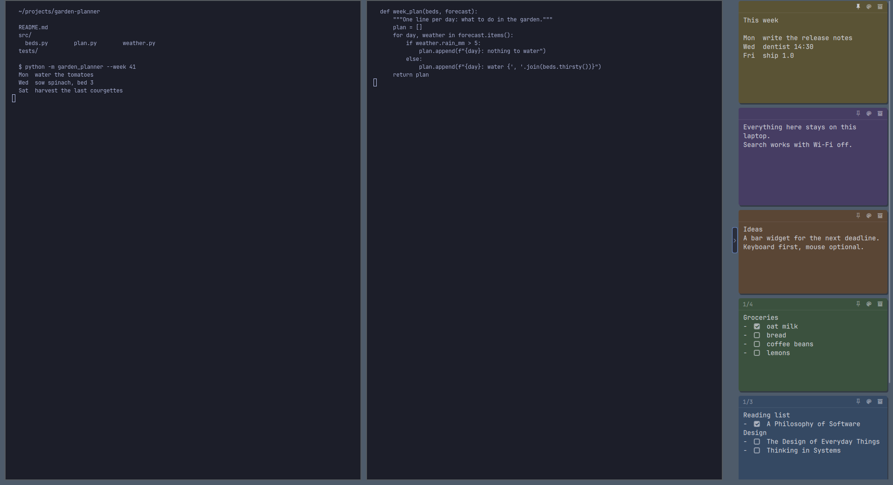
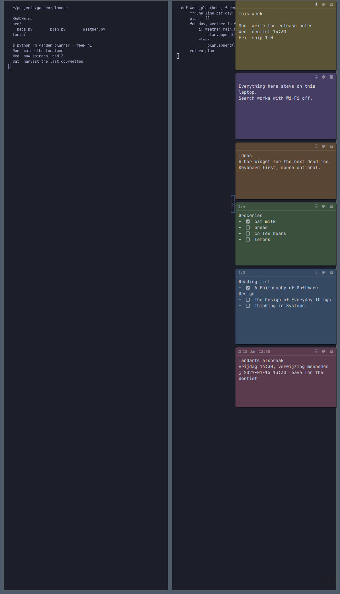

# Layouts

Three layouts, switched with `SUPER + ALT + L`, the picker in the bar
widget's panel, or `stickies layout`; all three are the same setting, and
every surface follows a change wherever it was made.

| free | waterfall right | waterfall left |
|---|---|---|
|  |  |  |

- **free** (the default): notes where you put them, on the desktop under
  your windows (summon them with the keys above).
- **waterfall right / left**: the current workspace's notes (and pinned
  ones, which are on every workspace) as one column at that edge of the
  focused monitor, **above** your tiled windows, on every workspace; it
  follows you to the other monitor. Pinned notes first, then the most
  recently edited, each note its own height, 320 px wide (`--width`);
  more than fits scrolls inside the column. Only the column takes clicks;
  the rest of the screen goes to your windows as usual. Windows aren't
  pushed aside unless you turn on `--reserve on`, which keeps the column's
  width free like a bar (below, left).
- **Collapse**: the little handle on the column's inner edge (or
  `SUPER + ALT + W`) folds it to a 6 px strip at the screen edge; click the
  strip to bring it back. Remembered.
- **Drag in the column** to reorder (remembered); **drag a note out** onto
  the desktop and it stays free right there, in any layout; drop a free note
  on the column to put it back.
- **Nothing moves for good.** The column never touches a note's free
  position: switch back to free and every note is exactly where it was.
  Switching glides the notes between their spots and the column (130 ms,
  at the display's frame rate; [measured](PERF.md#layouts-bench_waterfallpy)).

| reserve on | rotated monitor |
|---|---|
|  |  |
