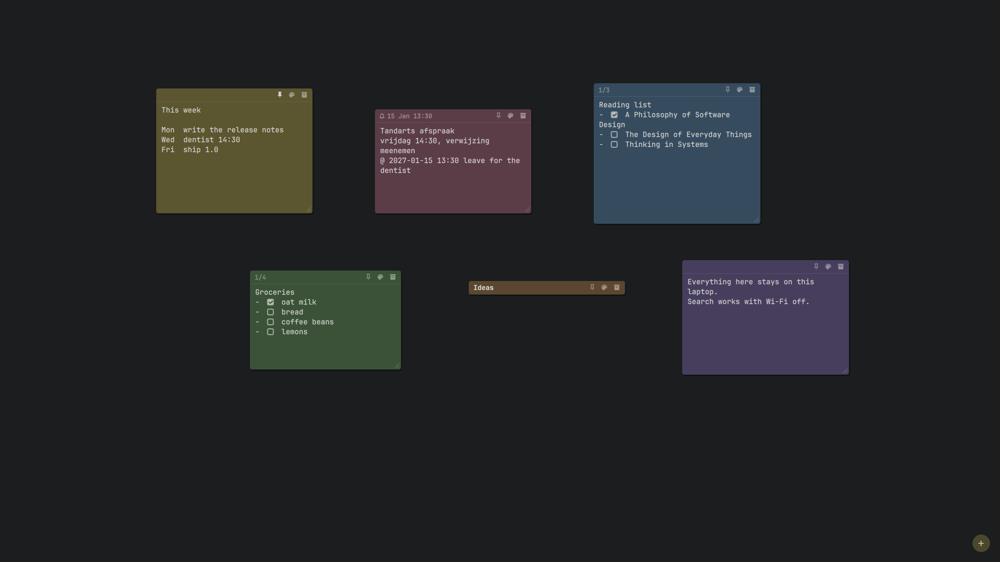

# Notes: checklists, reminders, roll-up, tidy

What a note can do besides holding text. Keys and the desktop basics are in
the [README](../README.md#keys); the desktop plugin in detail is in
[shell.md](shell.md).

- **Checklists.** A line starting with `[ ]` or `[x]` (also `- [ ]`,
  `* [x]`) shows a checkbox; clicking it flips the `x` in the text, and
  the header counts `2/5`.
- **Undo.** Archiving shows *Archived - Undo* for 6 s; `stickies undo`
  restores the most recently archived note (again: the one before).
- **Theme colours.** The six colours follow the active Omarchy theme and
  recolour live when you switch it; a note keeps its colour *name*, so
  pink stays pink in every theme.
- **Roll-up.** Double-click a note's header to fold it to one line (its
  first line as the title); again to open it. Remembered per note.
- **Tidy.** *Tidy* in the bar panel (or `stickies tidy`) lines up this
  workspace's unpinned notes in rows, Hyprland's `gaps_out` apart, clear of
  the bar; *Undo tidy* (or `stickies tidy --undo`) puts them back, once.
  Dragging snaps to an 8 px grid and to other notes' edges, with a faint
  guide line; hold **Shift** to place a note freely. Both are for the free
  layout: in a waterfall the column decides where notes go, so the *Tidy*
  button is hidden and `stickies tidy` says so. Checklists, roll-up and
  the bell work the same in the column (a rolled-up note takes one line).
- **Quick capture.** `SUPER + ALT + V` turns the clipboard's text into a
  note (trimmed, at most 10,000 characters). An image or an empty
  clipboard says so instead.
- **Reminders.** A line like `@ 2026-10-07 09:00`, `@tomorrow 9:00`
  (`@morgen`, `@today`, `@vandaag` too) or `@ 17:30 call the plumber` sends a
  desktop notification at that time; the note shows a bell with the time.
  The rest of the line is the message. A relative day counts from when you
  wrote it; a date already past when written never rings. The desktop
  plugin's `stickies serve` sends them (no extra daemon); one that came due
  while it wasn't running is sent once when it starts. `stickies
  reminders` lists the pending ones.
- **Plain words.** Problems show as a sentence (a toast on the desktop,
  `stickies: ...` in the terminal); the details of anything unexpected go
  to `~/.local/state/stickies/stickies.log`, never a traceback on screen.
