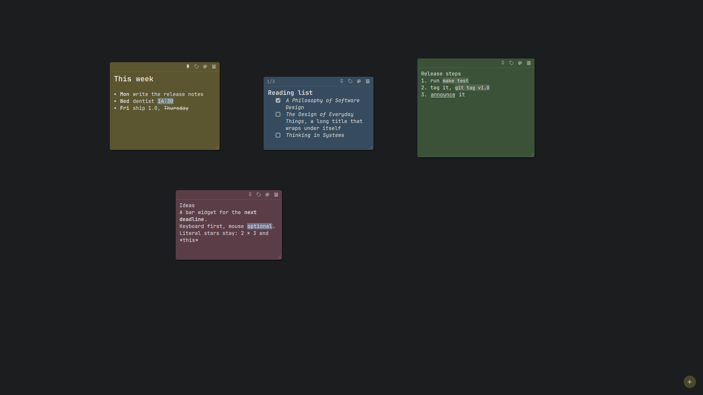

# Notes: markup, checklists, reminders, roll-up, tidy

What a note can do besides holding text. Keys and the desktop basics are in
the [README](../README.md#keys); the desktop plugin in detail is in
[shell.md](shell.md).

- **Checklists.** A line starting with `[ ]` or `[x]` (also `- [ ]`,
  `* [x]`) shows a checkbox; clicking it flips the `x` in the text, and
  the header counts `2/5`.
- **Undo.** Archiving shows *Archived - Undo* for 6 s; `stickies undo`
  restores the most recently archived note (again: the one before).
- **Theme colours.** The six colours follow the active Omarchy theme and
  recolour live when you switch it; a note keeps its colour *name*, so
  pink stays pink in every theme.
- **Roll-up.** Double-click a note's header to fold it to one line (its
  first line as the title); again to open it. Remembered per note.
- **Tidy.** *Tidy* in the bar panel (or `stickies tidy`) lines up this
  workspace's unpinned notes in rows, Hyprland's `gaps_out` apart, clear of
  the bar; *Undo tidy* (or `stickies tidy --undo`) puts them back, once.
  Dragging snaps to an 8 px grid and to other notes' edges, with a faint
  guide line; hold **Shift** to place a note freely. Both are for the free
  layout: in a waterfall the column decides where notes go, so the *Tidy*
  button is hidden and `stickies tidy` says so. Checklists, roll-up and
  the bell work the same in the column (a rolled-up note takes one line).
- **Quick capture.** `SUPER + ALT + V` turns the clipboard's text into a
  note (trimmed, at most 10,000 characters). An image or an empty
  clipboard says so instead.
- **Reminders.** A line like `@ 2026-10-07 09:00`, `@tomorrow 9:00`
  (`@morgen`, `@today`, `@vandaag` too) or `@ 17:30 call the plumber` rings
  at that time; the note shows a bell with the time. The rest of the line
  is the message. It shows on the desktop: the notes come up above the
  windows for 15 s with a toast that says the message and a Show button
  that raises the note. The system notification only says that a note is
  due ("Reminder for sticky note #12"; a click on it shows the note too),
  never what it says: notification servers keep what they show, and
  Omarchy's writes it to files other accounts on the machine can read.
  A relative day counts from when you
  wrote it; a date already past when written never rings. The desktop
  plugin's `stickies serve` sends them (no extra daemon); one that came due
  while it wasn't running is sent once when it starts. `stickies
  reminders` lists the pending ones.
- **Plain words.** Problems show as a sentence (a toast on the desktop,
  `stickies: ...` in the terminal); the details of anything unexpected go
  to `~/.local/state/stickies/stickies.log`, never a traceback on screen.

## Markup

A note can carry a little Markdown-style markup, styled as you type.
While you edit a note the markers stay where you typed them, faint; when
the note loses focus they hide and only the styled words show. The note
itself stays plain text with the markers in it, so the CLI, `--json`,
scripts, agents and chat see exactly what you typed.

| You type | You see |
|---|---|
| `**bold**` | **bold** |
| `*italic*` | *italic* |
| `__underline__` | underlined (Markdown has no underline: here `__` means it) |
| `~~strike~~` | ~~struck through~~ |
| `==highlight==` | a marker-pen background in your theme's accent colour |
| `` `code` `` | monospace on a faint background |
| `# Heading` / `## Heading` | a bigger, bold line (`###` stays as typed) |
| `- item` / `* item` | a bullet; wrapped lines line up under the text |
| `1. item` / `1) item` | a numbered item, wrapped the same way |
| `- [ ] item` | a checkbox (see Checklists above); it takes markup too |
| `\*` | a literal `*` (a backslash before any punctuation mark) |

The rules, so nothing surprises you:

- Markers pair on the same line. A lone `*` or `**` stays as typed, and so
  does a pair with a space just inside it: `2 * 3 * 4` and `** a **` are
  plain text.
- What a pair holds must be more than the marker's own character:
  `****` is four stars.
- Inside `` `code` `` nothing else is parsed: `` `**x**` `` shows the stars.
- Pairs nest: `**bold *and italic***`.
- A single `_` is never markup, so `snake_case` is safe; `__init__` does
  underline (write `` `__init__` `` to keep it).

**Keys** in a note: `Ctrl + B` bold, `Ctrl + I` italic, `Ctrl + U`
underline, `Ctrl + Shift + X` strike, `Ctrl + Shift + H` highlight,
`Ctrl + E` code. Each wraps the selection, or unwraps it if it is wrapped
already; without a selection it puts an empty pair around the caret.
`Ctrl + L` puts a `[ ] ` checkbox on the line, or takes it off.
`Ctrl + Z` / `Ctrl + Shift + Z` (or `Ctrl + Y`) undo and redo, a word at a
time; one of the keys above or a checkbox click is one step.

**Elsewhere the words are plain.** A rolled-up note's title, All notes,
the bar widget, search results and reminder messages show the words
without markers, and search finds `**milk**` when you type "milk".
Search by meaning reads the words without markers too (notes written
before this version are read again once, by themselves).

Typing stays quick in a long note: in a 2,000-character note full of
markup on an i7-8550U, a real keystroke reached the screen in 5.9 ms
(median), 12.4 ms at the 95th percentile.
